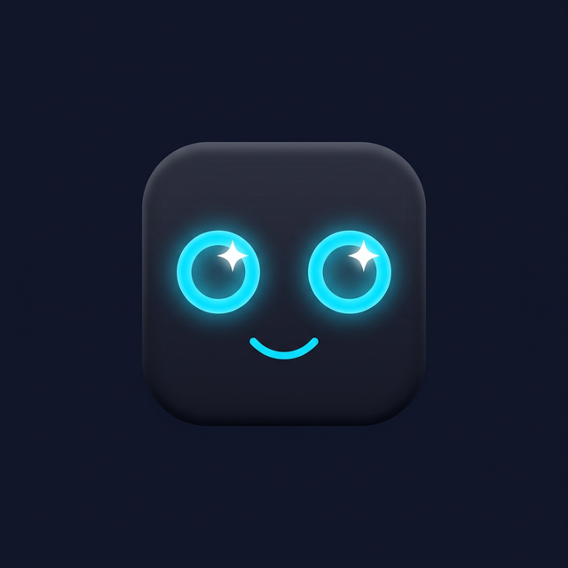

# 🤖 Emo Robot Companion

> A privacy-first, locally-run AI desktop companion with expressive animated eyes, voice interaction, and full task automation — powered by Tauri and quantized Qwen 2.5 models.



---

## ✨ Features

| Feature | Description |
|---------|-------------|
| 🧠 **Local AI** | Qwen 2.5-0.5B (chat) and 1.5B (reasoning) — runs 100% offline |
| 👁️ **Expressive Eyes** | Animated eyes with idle, happy, thinking, listening, error states |
| 🎤 **Voice Control** | Whisper-based STT + Piper TTS with "Hey Emo" wake word |
| 🤖 **Agentic Loop** | Full tool-use pipeline: intent → model → tool call → result → response |
| 📂 **File Automation** | Search, read, write, move, delete, and organise files |
| 🖥️ **App Control** | Launch, close, list apps; focus windows by title |
| 📋 **Clipboard** | Read and write clipboard contents |
| 📸 **Screenshot** | Capture the screen on demand |
| 🌐 **Web** | Open URLs and trigger Google searches |
| ⏱️ **Productivity** | Set timers, create reminders |
| 💾 **Memory** | SQLite-backed conversation history with context injection |
| 🔒 **Privacy** | Zero telemetry, zero network calls during inference |

---

## 🚀 Quick Start

### Prerequisites

| Tool | Version |
|------|---------|
| [Rust](https://rustup.rs) | 1.77+ |
| [Node.js](https://nodejs.org) | 18+ |
| [Python](https://python.org) | 3.10+ |

### Setup

```bash
# 1. Clone the repository
git clone https://github.com/yourname/emo-robot-companion
cd emo-robot-companion

# 2. Install frontend dependencies
npm install

# 3. Download AI models (~2 GB total)
pip install huggingface_hub
python scripts/download_models.py

# 4. Run in development mode
npm run tauri:dev
```

### Production Build

```bash
# Windows installer (.msi + NSIS .exe)
npm run tauri:build:win

# macOS disk image (.dmg)
npm run tauri:build:mac

# Linux (.deb + .AppImage + .rpm)
npm run tauri:build:linux
```

Installers are output to `src-tauri/target/release/bundle/`.

---

## 🏗️ Architecture

```
┌────────────────────────────────────────────┐
│            Frontend  (React + Tauri)        │
│  EmoRobot.jsx  ←→  Eyes.jsx               │
│  Chat.jsx (agent steps UI)                 │
│  Settings.jsx  (model / voice / display)   │
└────────────────────────────────────────────┘
                    ↕  Tauri IPC
┌────────────────────────────────────────────┐
│              Rust Backend                   │
│  ai/router.rs      — 0.5B vs 1.5B routing  │
│  ai/prompts.rs     — system prompts + tool  │
│                      schema + parser        │
│  ai/model_manager.rs — GGUF inference       │
│  ai/tools.rs       — 20+ automation tools  │
│  voice/stt.rs      — Whisper STT           │
│  voice/tts.rs      — Piper TTS             │
│  voice/voice_manager.rs — VAD + loop       │
│  lib.rs            — agent_run REPL loop   │
└────────────────────────────────────────────┘
```

### Agent Loop (Phase 4)

```
User Input (voice or text)
    ↓
router::route()  →  ModelTier::Small | Large
    ↓
prompts::build_agent_prompt()
    ↓
LLM inference (QwenModel::generate)
    ↓
prompts::parse_tool_call()  ──→  No tool?  →  Return response
    ↓ (tool needed)
dispatch_tool() in lib.rs
    ↓
Tool executes (file, app, web, system…)
    ↓
Second LLM pass with tool result
    ↓
AgentStep[] returned to frontend
```

---

## 🤖 AI Model Stack

| Model | Size | Use Case | Speed |
|-------|------|----------|-------|
| Qwen 2.5-0.5B-Instruct Q4_K_M | ~400 MB | Greetings, simple chat, quick tool calls | 30–50 tok/s CPU |
| Qwen 2.5-1.5B-Instruct Q4_K_M | ~1.2 GB | Complex reasoning, coding, multi-step tasks | 15–25 tok/s CPU |
| Whisper Tiny | ~75 MB | Speech-to-text | Real-time |
| Piper TTS (en_US lessac medium) | ~20 MB | Text-to-speech | Low latency |

> **Model routing** is automatic. Simple greetings → 0.5B. Long prompts, file ops, code → 1.5B (if loaded). Manual load/unload available in Settings.

---

## 🔧 Available Tools

| Category | Tools |
|----------|-------|
| **Files** | `file_search`, `file_read`, `file_write`, `file_move`, `file_delete`, `list_directory`, `folder_organize` |
| **Apps** | `app_launch`, `app_close`, `app_list`, `window_focus` |
| **System** | `system_info`, `screenshot`, `clipboard_read`, `clipboard_write` |
| **Web** | `web_open`, `web_search` |
| **Productivity** | `timer_set`, `reminder_create` |

The LLM uses a structured `<tool_call>{"tool": "...", "args": {...}}</tool_call>` format to invoke tools. Results are fed back to the model for a natural-language summary.

---

## 📁 Project Structure

```
emo-robot-companion/
├── src/                      # React frontend
│   └── components/
│       ├── EmoRobot.jsx      # Main widget + voice controller
│       ├── Eyes.jsx          # Animated eye canvas
│       ├── Chat.jsx          # Agent-step-aware chat UI
│       └── Settings.jsx      # 4-tab settings panel
├── src-tauri/
│   └── src/
│       ├── ai/
│       │   ├── model_manager.rs  # GGUF loading + inference
│       │   ├── prompts.rs        # System prompts, tool schema, parser
│       │   └── router.rs         # Intent-based model routing
│       ├── voice/
│       │   ├── stt.rs            # Whisper STT
│       │   ├── tts.rs            # Piper TTS
│       │   └── voice_manager.rs  # VAD + listening loop
│       ├── ai/tools.rs           # 20+ automation tools
│       └── lib.rs                # agent_run + all Tauri commands
├── scripts/
│   ├── download_models.py        # Downloads all required models
│   └── convert_models.py         # Optional: GGUF conversion helpers
└── models/                       # Downloaded models (gitignored)
```

---

## ⚡ Performance Targets

| Scenario | CPU | RAM |
|----------|-----|-----|
| Idle (no AI) | < 5% | ~100 MB |
| Listening (STT active) | 10–15% | ~200 MB |
| 0.5B inference | 15–20% | ~600 MB |
| 1.5B inference | 25–30% | ~1.5 GB |
| TTS playback | 5–10% | ~150 MB |

The 1.5B model auto-unloads after 5 minutes of idle use to free RAM.

---

## 🔒 Privacy

- **100% offline** — no data leaves your device during normal use
- **No telemetry** of any kind
- **Conversation history** stored locally in SQLite (`~/.emo-robot/data.db`)
- **Voice recordings** are never stored — processed in-memory only
- **Model downloads** require internet only once, then stored locally

---

## 🛠️ Development

```bash
# Run dev server + Tauri window
npm run tauri:dev

# Rust-only type check (fast)
cd src-tauri && cargo check

# Run Rust tests
cd src-tauri && cargo test

# Frontend lint
npm run lint
```

### Adding a New Tool

1. Add the method to `src-tauri/src/ai/tools.rs` in `impl ToolManager`
2. Add a `#[tauri::command]` wrapper in `lib.rs`
3. Register it in `tauri::generate_handler![]`
4. Add a `match` arm to `dispatch_tool()` in `lib.rs`
5. Document it in the `TOOL_SCHEMA` string in `ai/prompts.rs`

---

## 📦 Building Installers

```bash
# Install Rust cross-compilation targets first:
rustup target add x86_64-pc-windows-msvc
rustup target add aarch64-apple-darwin
rustup target add x86_64-unknown-linux-gnu

# Then build:
npm run tauri:build          # Current platform
npm run tauri:build:win      # Windows NSIS + MSI
npm run tauri:build:mac      # macOS DMG
npm run tauri:build:linux    # Linux .deb + .AppImage + .rpm
```

---

## 🗺️ Roadmap

- [x] Phase 1: Foundation — animated widget, Qwen 0.5B, text chat
- [x] Phase 2: Voice — Whisper STT, Piper TTS, wake word, VAD
- [x] Phase 3: Automation — 20+ tools across files, apps, system, web
- [x] Phase 4: Agent Intelligence — model router, tool schema, REPL loop
- [x] Phase 5: Polish — Settings panel, packaging, documentation
- [ ] v2.0: Screen understanding (vision model), Plugin API, Mobile

---

## 📄 License

**MIT License** — free to use, modify, and distribute.

---

*Built with ❤️ using [Tauri](https://tauri.app), [Candle](https://github.com/huggingface/candle), and [Qwen 2.5](https://huggingface.co/Qwen).*
